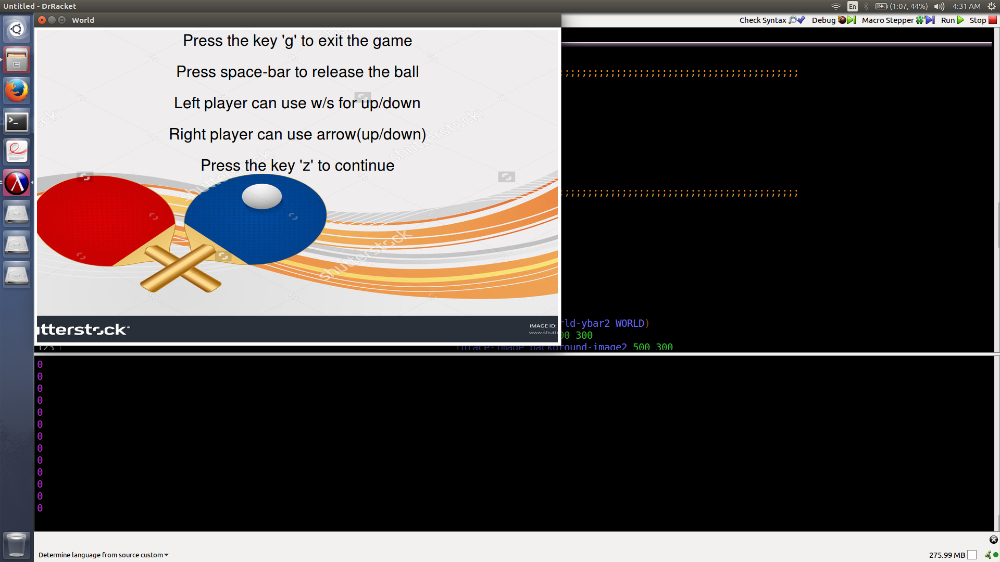
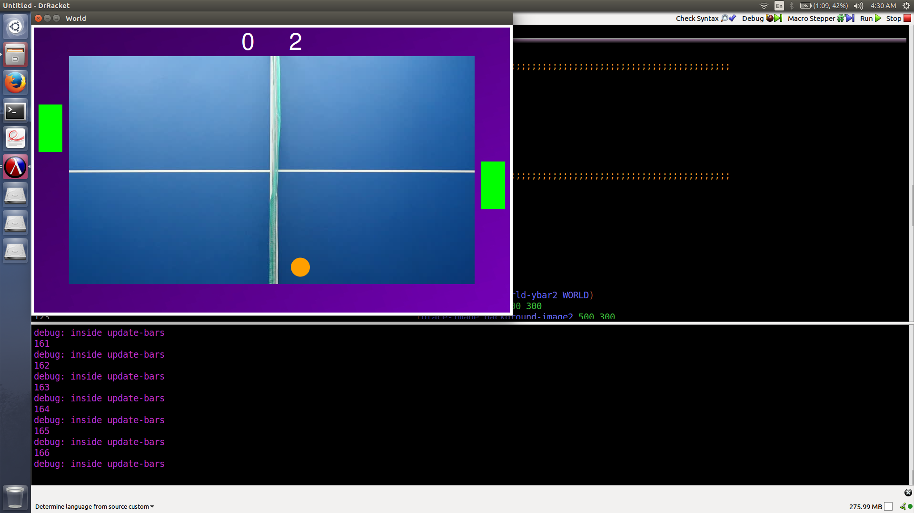
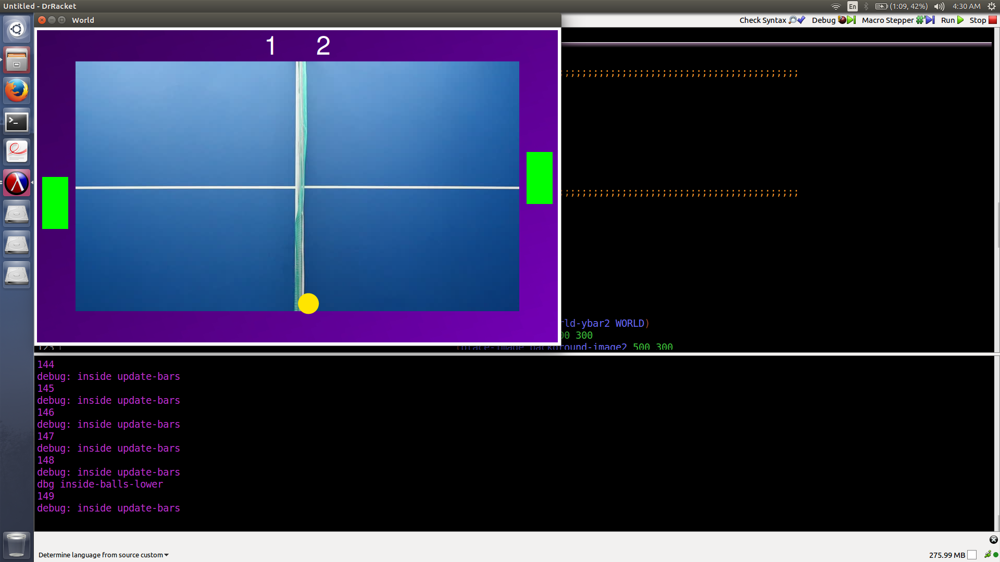
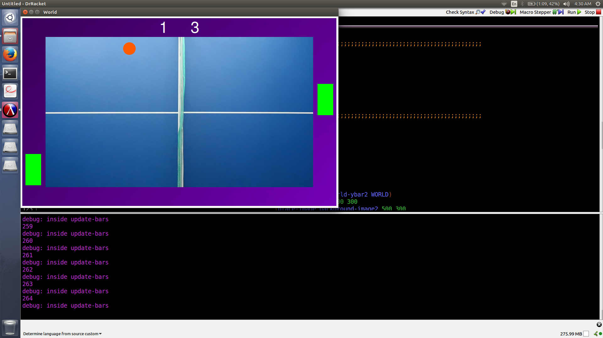
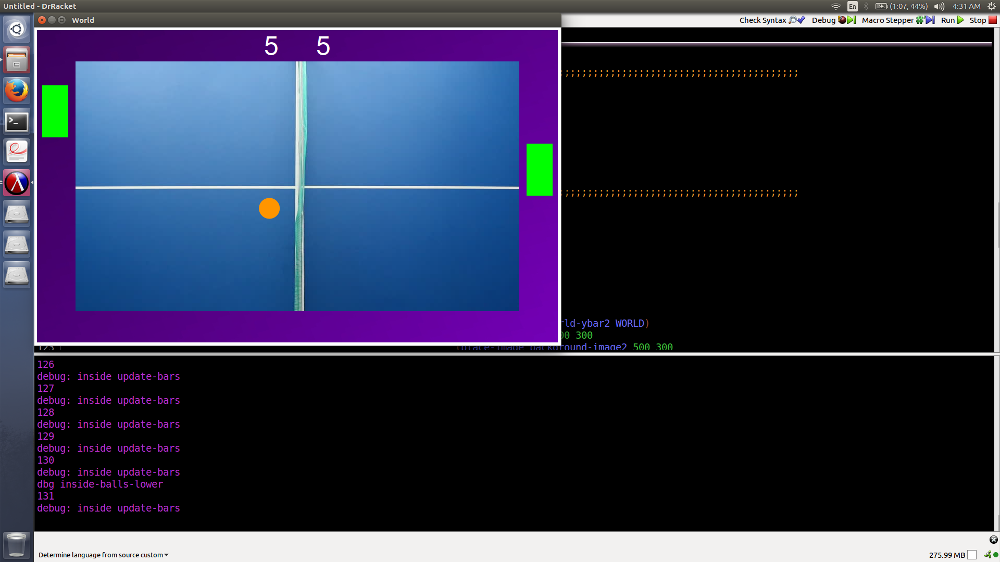
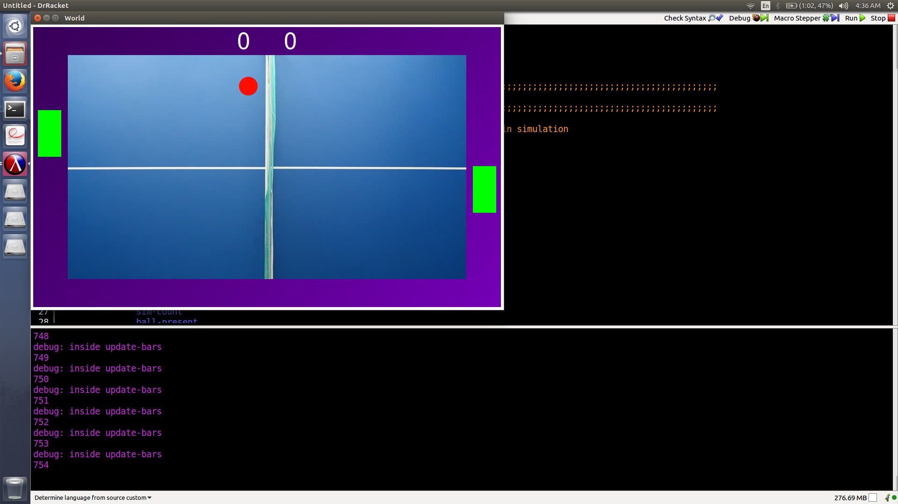
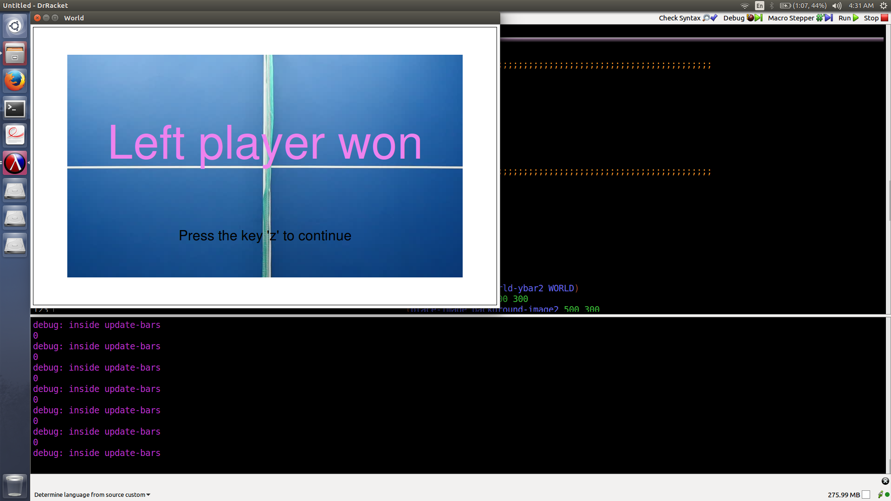

# Ping Pong Game DrRacket

## Contributors

[Samarjeet Sahoo](https://github.com/samar97)

[Aniket Shirke](https://github.com/ani8897)

[Uddeshya Upadhyay](https://github.com/udion)

## Files

### Main File

1. [ping.rkt](ping.rkt): main file for running the game

### Helper Files

1. [constants.rkt](constants.rkt): File containing all the defined constants of the game state
2. [update.rkt](update.rkt): File containing the functions which update the various game state parameters during the simulation

## Screenshots

